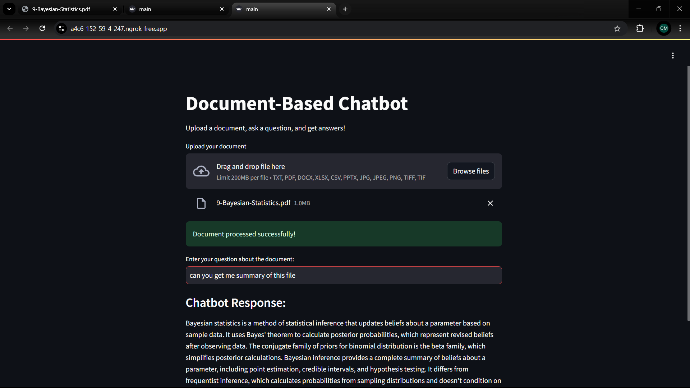

Here's a comprehensive `README.md` file for your project:

---

# **Document-Based Chatbot with Streamlit and Cohere**

This project is a document-based chatbot built with **Streamlit** and **Cohere**, allowing users to upload various types of documents (e.g., PDFs, Word files, Excel sheets, etc.) and ask questions about their content. The chatbot provides concise and accurate responses based on the uploaded document. The app is exposed to the web using **Ngrok**.

---

## **Features**
- Supports multiple file types:
  - Text files (`.txt`)
  - PDF files (`.pdf`)
  - Microsoft Word files (`.docx`)
  - Excel files (`.xlsx`, `.xls`, `.csv`)
  - PowerPoint presentations (`.pptx`)
  - Image files (`.jpg`, `.jpeg`, `.png`, `.tiff`)
- Uses the **Cohere API** to generate accurate answers to user queries.
- Exposed to the internet via **Ngrok** for easy sharing.

---

## **Requirements**

### 1. **Python Dependencies**
All required libraries are listed in `requirements.txt`. These include:
- `streamlit`
- `cohere`
- `PyPDF2`
- `pandas`
- `python-docx`
- `python-pptx`
- `pytesseract`
- `Pillow`
- `pyngrok`

Install the dependencies using the following command:
```bash
pip install -r requirements.txt
```

### 2. **API Keys**
You need two API keys:
1. **Cohere API Key**: To interact with Cohere's language model.
2. **Ngrok Auth Token**: To expose the Streamlit app to the web.

---

## **How to Obtain API Keys**

### 1. **Cohere API Key**
- Sign up for a Cohere account at [Cohere's Website](https://cohere.ai/).
- Once registered, navigate to the API Keys section in the dashboard.
- Copy your API key.

### 2. **Ngrok Auth Token**
- Sign up for a Ngrok account at [Ngrok's Website](https://ngrok.com/).
- After logging in, go to the "Auth" section in your dashboard.
- Copy your auth token.

---

## **Setup Instructions**

### 1. **Clone the Repository**
```bash
git clone https://github.com/your-repository-url.git
cd your-repository-name
```

### 2. **Install Dependencies**
Ensure Python 3.7+ is installed. Install the dependencies:
```bash
pip install -r requirements.txt
```

### 3. **Add API Keys**
- Create a new file named `config.py` in the root directory.
- Add your API keys to the file as shown below:
```python
# config.py

config = {
    "COHERE_API_KEY": "your-cohere-api-key",
    "NGROK_AUTH_TOKEN": "your-ngrok-auth-token"
}
```

### 4. **Run the Application**
Start the Streamlit app using:
```bash
python app.py
```

### 5. **Access the App**
The app will generate a public URL using Ngrok. Look for output like:
```
Streamlit app is live at: https://<your-ngrok-url>.ngrok.io
```
Open the URL in your web browser.

---

## **Usage**

1. Upload a document in the supported format.
2. Type a question related to the document in the input box.
3. View the chatbot's response below the input box.

---



## **File Structure**

```
project-directory/
│
├── app.py                # Main application file
├── config.py             # Configuration file for API keys
├── requirements.txt      # Dependencies for the project
├── README.md             # Project documentation
└── temp/                 # Temporary directory for uploaded files
```

---

## **Contributing**

Feel free to fork the repository and contribute by submitting pull requests. For major changes, please open an issue first to discuss what you would like to change.

---

## **License**

This project is licensed under the MIT License. See the [LICENSE](LICENSE) file for details.

---

## **Contact**
For questions or suggestions, please reach out to:

- Email: your-email@example.com
- GitHub: [Your GitHub Profile](https://github.com/your-profile)

---

### **Notes**
- Keep your `config.py` file private and do not share your API keys.
- If using version control, add `config.py` to `.gitignore` to prevent accidental commits of sensitive information.

---

### **Example Commands**

1. Install dependencies:
   ```bash
   pip install -r requirements.txt
   ```
2. Start the app:
   ```bash
   python app.py
   ```
3. Access the app via the Ngrok-generated URL. 

Enjoy using your Document-Based Chatbot! 🎉
